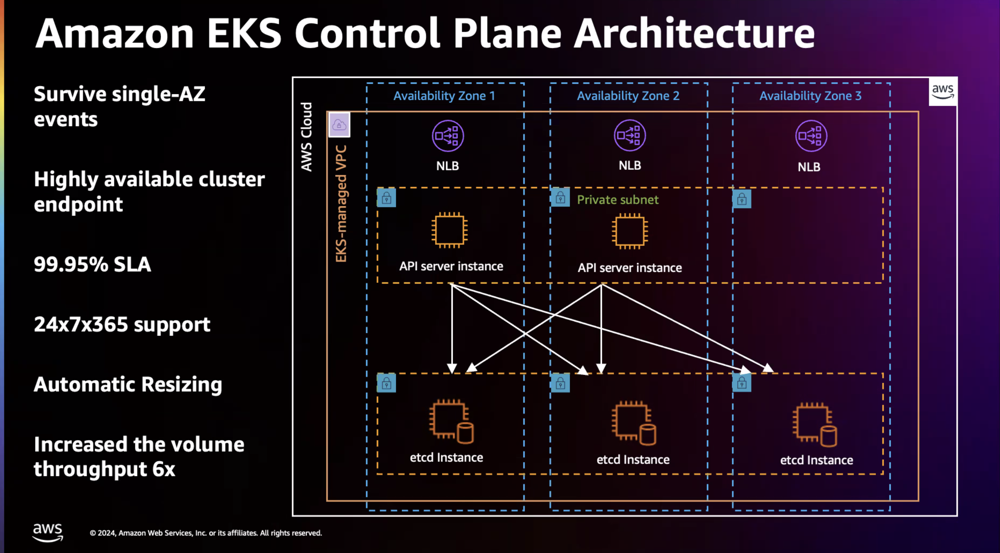
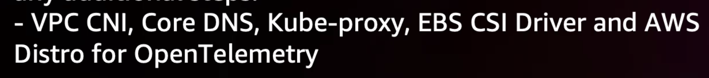
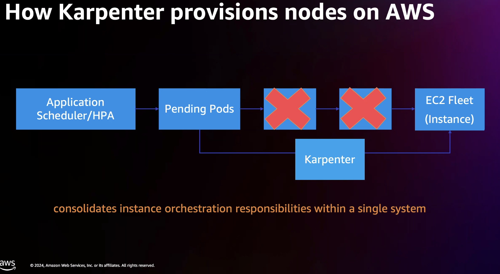
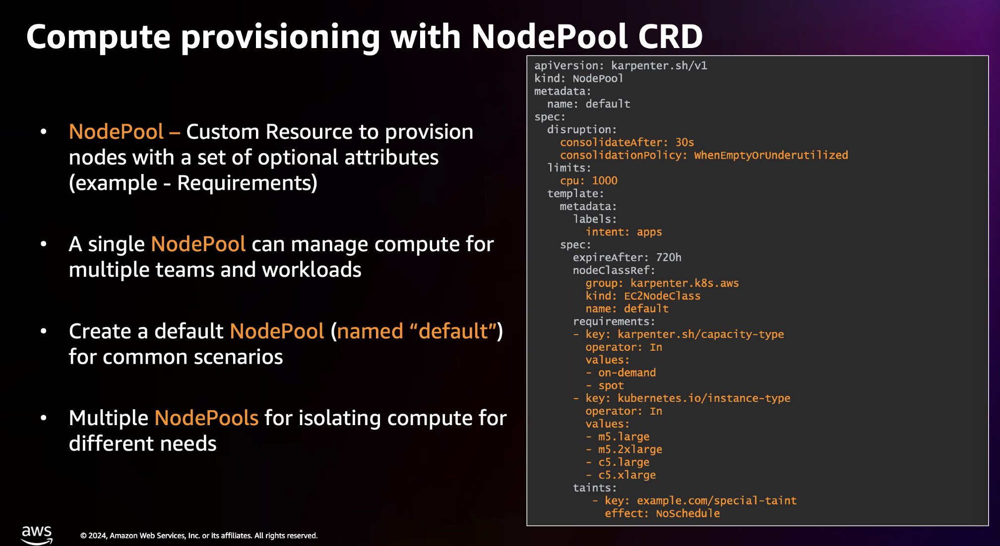

NDA- New compute platform coming for AWS Fargate
- starchian?? 
- EC@ instances will be spun up in the user's accounts

Roadmap exits to add AWS Ingress controller to a managed addon in EKS

When using EKS Blueprints do not hardcode the addons version, Upgrading the cluster will automatically pull the latest version.

https://catalog.us-east-1.prod.workshops.aws/sign-in?redirect=%2Fjoin%3Faccess-code%3Da889-0a2d26-72

EKS uses Karpenter for nodes scaling

Needs to be installed by helm by user, EKS will switch to karptenter in the future

AWS Claims that karpenter is faster than Cluster Autoscaler

Karpenter is groupless autoscaler

will make direct calls to EC2 API

The nodes will not be behind an ASG

Nodepools can be provisioned from the cluster, by installing CRDs and creating nodepool objects in the manifest file.

